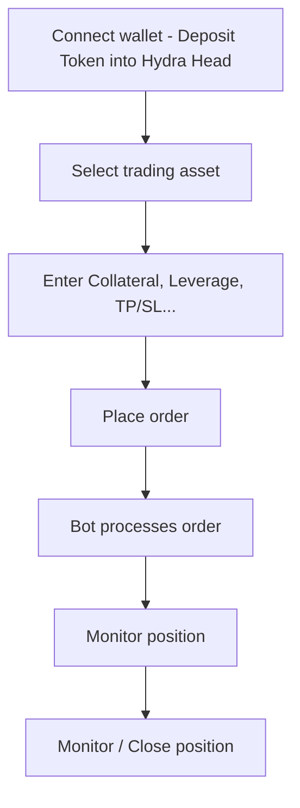
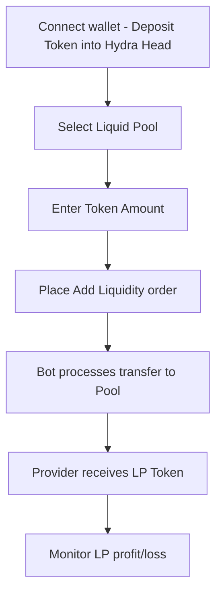
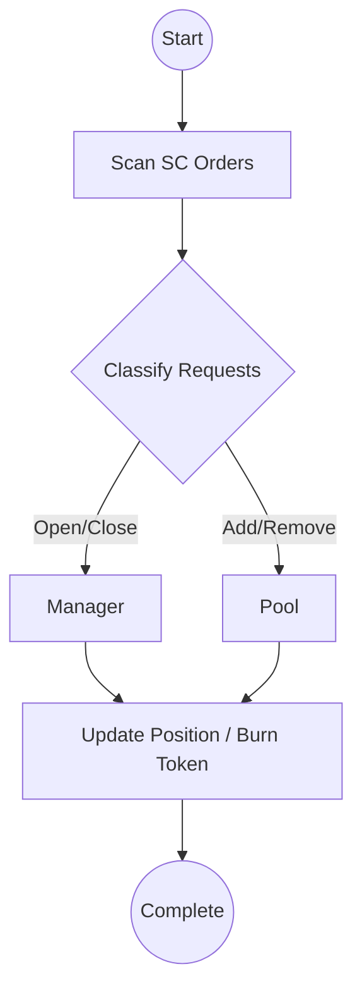

# BUSINESS REQUIREMENT DOCUMENT (BRD)

---

## **1. Introduction**

### 1.1 Document Purpose

This document defines the **business objectives, business requirements, constraints, and scope of the Hydra One project**, serving as the basis for:

* Building functional specifications and technical design (SDD).
* Ensuring all user and organizational requirements are accurately reflected.
* Providing the foundation for testing and evaluating the project’s success.

### 1.2 Scope of Application

Hydra One is a **decentralized derivatives exchange (Perpetual DEX)** operating on **Cardano’s Hydra Layer-2**, enabling:

* Users to trade Long/Short leveraged positions.
* Providing and withdrawing liquidity through the Liquid Pool.
* Managing positions, automated closing, liquidation, and funding calculations.

---

## **2. Business Objectives**

| ID | Objective | Expected Result | KPI |
|----|-----------|-----------------|-----|
| OB-01 | Create the first stable Perp exchange running on Hydra | Real Hydra Head application | ≥100 TPS |
| OB-02 | Reduce transaction fees to near zero | Implement Layer-2 micro-fee transactions | <0.01 ADA/tx |
| OB-03 | Improve realtime experience for traders & providers | Order processing <1s | Success rate ≥99% |
| OB-04 | Ensure transparency, decentralization, low latency | All positions stored on-chain | 100% traceable |
| OB-05 | Build an open SDK for developers | Enable Hydra SDK reuse | ≥2 external integrations |

---

## **3. Current Situation Analysis**

### 3.1 Current Cardano DeFi Ecosystem

* Mainly AMM DEXes (Minswap, SundaeSwap).
* Lack of **Perpetual Futures** — the highest-volume category in other ecosystems (GMX, dYdX, Aster, HyperLiquid).
* Current projects run entirely on Layer-1, limited by speed and cost.

### 3.2 Market Opportunity

* Hydra enables **CEX-level performance** for Cardano.
* Deploying Hydra One creates the **first real use case** for Hydra, boosting adoption and proving Cardano’s technical capabilities in derivatives.

---

## **4. Stakeholders**

| Role | Description | Responsibility |
|------|-------------|----------------|
| **PM / Product Owner** | Project management, product direction | Define requirements, approve scope |
| **Business Analyst (BA)** | Business analysis, requirement gathering | Write BRD, BPF, Use Case |
| **Smart Contract Dev** | Build Orders / Manager / Pool smart contracts | Develop & test logic |
| **Bot Developer** | Build automated Bot service | Automate order processing |
| **Frontend Dev** | Design & build frontend | Wallet integration, data display |
| **Tester / QA** | System testing | Ensure product quality |
| **Liquidity Provider (LP)** | Provide liquidity to the pool | Receive LP token rewards |
| **Trader** | Execute Long/Short trades | Increase volume, improve liquidity |

---

## **5. Project Scope**

### 5.1 In-Scope

| Item | Description |
|------|-------------|
| Perpetual Long/Short trading | Support Market and Limit orders |
| Liquidity Pool | Add / Withdraw liquidity |
| Position Management | Manage, update, and close positions |
| Bot System | Scan, process, liquidate, and handle funding |
| Web Interface (DApp) | Wallet integration (Nami/Eternl), realtime data |
| Hydra SDK Integration | High-speed Layer-2 transaction processing |

### 5.2 Out-of-Scope

| Item | Description |
|------|-------------|
| Cross-chain bridge | No asset bridging to other L1 chains |
| Mobile App | Mobile version not included in this phase |
| Perpetual Options | No options contract in MVP |
| Token Launch | No token issued in initial phase |

---

## **6. Business Requirements**

| ID | Requirement | Priority | Notes |
|----|-------------|----------|-------|
| BR-01 | Users can connect wallets (Nami, Eternl) or create a new wallet | High | UI supports CIP-30 |
| BR-02 | Traders open Long/Short positions with Market or Limit orders | High | Create UTxO on Orders SC |
| BR-03 | Bot reads and processes open/close requests | High | FIFO processing |
| BR-04 | System manages positions and updates PnL in realtime | High | Data from Manager SC |
| BR-05 | Funding fee updated hourly | Medium | Using Oracle |
| BR-06 | Providers add / withdraw liquidity | High | Mint/Burn LP Token |
| BR-07 | System auto-liquidates positions exceeding threshold | High | Based on Liquidation Price |
| BR-08 | UI displays balance, PnL, funding | Medium | Data from SC via API |
| BR-09 | Public audit of position data | Medium | On-chain Explorer |
| BR-10 | Open SDK for external developers | Low | API + Hydra SDK documentation |

---

## **7. Non-Functional Requirements**

| ID | Category | Requirement |
|----|-----------|-------------|
| NFR-01 | Performance | Transaction executed in <1s |
| NFR-02 | Security | Smart contract independently audited |
| NFR-03 | Scalability | Support 1000+ concurrent positions |
| NFR-04 | Fault Recovery | Bot handles errors & resubmits TX |
| NFR-05 | User Experience | Friendly, realtime interface |
| NFR-06 | Observability | Log all TX for auditing |
| NFR-07 | Compatibility | CIP-30, CIP-68 (Datum/Asset) compliant |

---

## **8. User Personas**

| Persona | Goal | Behavior | Need |
|--------|-------|----------|-------|
| **Professional Trader** | Look for fast, low-fee, decentralized perp trading | Trades multiple times per day with leverage | Fast, secure, transparent trading |
| **Provider (LP)** | Earn passive income from liquidity | Deposit/withdraw liquidity | Clear UI, transparent profit/loss |
| **Integration Developer** | Connect Hydra SDK to build L2 DApps | Call API and test Hydra Head | Detailed SDK documentation |

---

## **9. Business Process Overview**

### 9.1 Trader Flow

### 9.2 Provider Flow

### 9.3 Bot Flow

---

## **10. Constraints & Assumptions**

| Type | Content |
|------|----------|
| **Technical Constraints** | Depends on Hydra Node, Aiken, HydraSDK |
| **Legal Constraints** | Product for DeFi users, not regulated by CEX |
| **Assumptions** | Reliable Oracle data, stable Hydra network, low L1 fees |

---

## **11. Success Criteria**

| Criteria | Description |
|----------|-------------|
| ≥500 testnet users in first 3 months | Achieve community adoption |
| 99% successful Hydra transaction rate | Ensure technical stability |
| TVL ≥100,000 ADA in Pool | Successful launch phase |
| SDK adopted by ≥1 external project | Expand Hydra ecosystem |

---

## **12. Conclusion**

This BRD establishes **the complete business and core business requirements of Hydra One**. It is the foundation for:

* Detailed technical design (System Design Document).
* Consistent development and testing toward shared objectives.
* Ensuring the product achieves the **speed, transparency, and decentralization** that Hydra aims for.

> **Hydra One – Instant, transparent, secure, and decentralized trading.**
