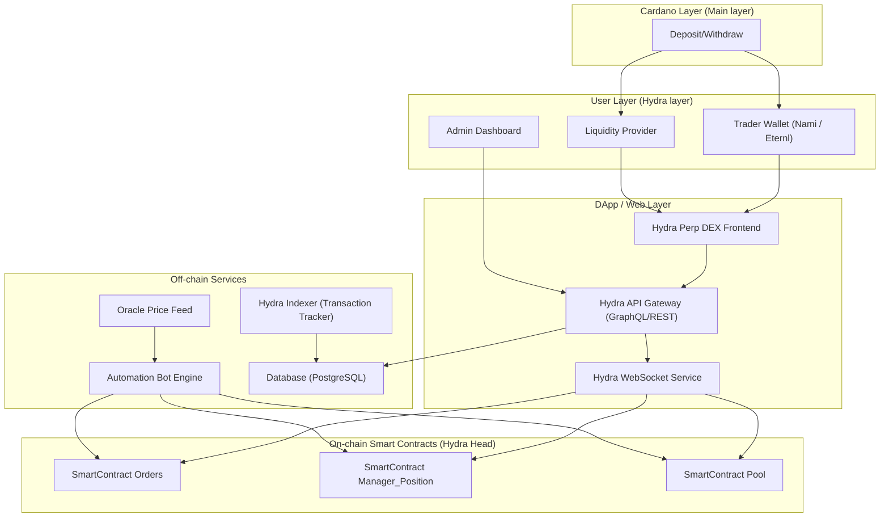
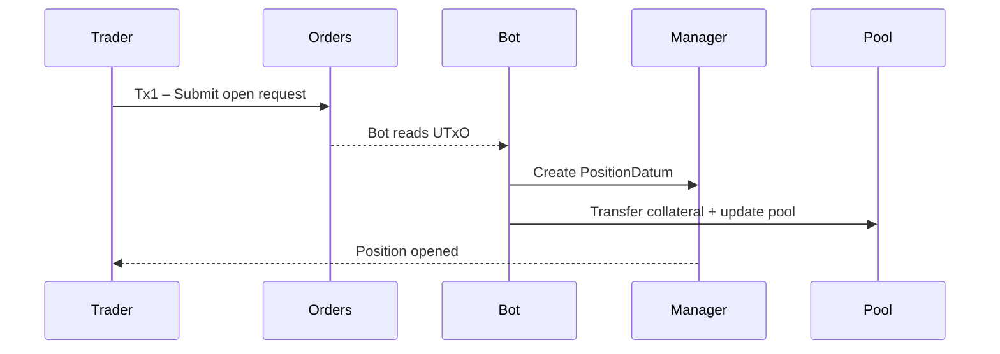

# Software Requirements Specification (SRS)

## 1. Introduction

### 1.1 Document Purpose
This Software Requirements Specification (SRS) defines the complete functional and non-functional requirements for **Hydra One**, a decentralized perpetual futures exchange built on **Cardano Hydra Layer-2**.  
It serves as a foundation for design, implementation, quality assurance, and long-term maintenance.

### 1.2 Project Scope
Hydra One is a **high‑performance perpetual DEX** designed to provide:
- Sub‑second trading (<1s)
- Near‑zero transaction fees
- Decentralized execution of trading, liquidity, and portfolio management  
- Full transparency with on‑chain auditability  
- A modular architecture that supports future expansion

The system includes:
- Smart Contracts (Orders, Manager, Pool)
- Automation Bot Engine
- Oracle market data service
- Hydra Head nodes for L2 settlement
- Web DApp (UI + API Gateway)

### 1.3 Definitions & Abbreviations
| Term | Definition |
|------|------------|
| **Perp / Perpetual** | A futures contract without expiry. |
| **Hydra** | Cardano’s high‑throughput L2 protocol using off‑chain state channels. |
| **Smart Contract (SC)** | On‑chain logic enforcing trading and liquidity rules. |
| **Bot Engine** | Off‑chain automation engine that builds & submits Tx2 transactions. |
| **Oracle** | External market price source (e.g., ADA/USD, BTC/USD). |
| **LP** | Liquidity Provider. |
| **PnL** | Profit and Loss of a position. |

---

## 2. System Overview

### 2.1 Main Goals
- Deliver the **fastest decentralized perpetual trading experience** on Cardano.
- Eliminate L1 transaction fees and batcher dependency.
- Provide CEX‑like performance while preserving decentralization and transparency.

### 2.2 High‑Level Architecture



---

## 3. Functional Requirements (FR)

### **FR‑01: Open Position**
Trader submits Tx1 → Bot validates order → Bot executes Tx2 to open the position using Manager SC.  
Result: new `PositionDatum` is created.

### **FR‑02: Close Position**
Trader submits Tx1 → Bot executes Tx2 to close and return funds (principal + PnL).

### **FR‑03: Auto TP/SL**
Bot monitors Oracle price every 2 seconds → executes automatic closing based on TP/SL.

### **FR‑04: Liquidation**
When margin reaches liquidation threshold, Bot auto‑closes position and protects the pool.

### **FR‑05: Add / Withdraw Liquidity**
LP submits Tx1 → Bot mints/burns LP tokens and updates pool.

### **FR‑06: Hourly Funding Rate**
Bot updates funding rate every hour using:

```
funding_rate = base_rate × (LongOpenInterest - ShortOpenInterest) / TotalOpenInterest
```

The funding rate adjusts based on market imbalance and is stored in PoolDatum.

### **FR‑07: Web DApp UI**
- Wallet connection (Nami/Eternl)
- Real-time charts & order forms
- Position list, PnL, TP/SL
- LP management interface
- Funding/APY analytics

---

## 4. Non‑Functional Requirements (NFR)

| ID | Category | Description | Target |
|----|----------|-------------|--------|
| NFR‑01 | Performance | Transaction processing time | <1s |
| NFR‑02 | Security | No centralized private keys | Required |
| NFR‑03 | Scalability | ≥50 tx/s per Hydra Head | Required |
| NFR‑04 | Availability | System uptime | 99.9% |
| NFR‑05 | Transparency | Entirely on‑chain auditable | Yes |
| NFR‑06 | Monitoring | Logs, metrics, alerts | Real‑time |
| NFR‑07 | UX | Smooth interaction & realtime charts | Required |

---

## 5. System Requirements

### **5.1 On‑Chain Components**
- **SC_Orders** — stores pending requests (Tx1)
- **SC_Manager_Position** — maintains positions, PnL, TP/SL
- **SC_Pool** — manages liquidity, LP tokens, funding rate

### **5.2 Off‑Chain Components**
- Automation Bot Engine  
- Oracle Price Feed  
- API Gateway (REST/GraphQL)  
- Database (PostgreSQL) for cache, history, snapshots  

---

## 6. Security Requirements
- All transactions must be signed by the user's wallet.
- Bot cannot withdraw funds; only processes pending requests.
- Each transaction uses a nonce to prevent replay attacks.
- All funding and pool logic must be verifiable through datum hashing.
- Periodic audit of smart contracts and service logs.

---

## 7. Core Data Structures

### 7.1 `PositionDatum`
```markdown

pub type PositionType {
  MarketOrder
  LimitOrder
}

pub type PositionSide {
  Long
  Short
}

pub type PositionDatum {
  owner_pkh: AddressHash,
  owner_stake_key: Option<AddressHash>,
  entered_position_time: POSIXTime,
  entered_at_usd_price: Int,
  stop_loss: Int,
  take_profit: Int,
  position_policy_id: PolicyId,
  manage_positions_script_hash: ScriptHash,
  collateral_asset: Asset,
  maintain_margin_amount: Int,
  hourly_borrow_fee: Int,
  collateral_asset_amount: Int,
  position_asset_amount: Int,
  side: PositionSide,
}
```

### 7.2 `PoolDatum`
```markdown
pub type PoolDatum {
  underlying_asset: Asset,
  lp_asset: Asset,
  liquidity_total_asset_amount: Int,
  liquidity_total_lp_minted: Int,
  total_lended_amount: Int,
}
```

---

## 8. Transaction Flow


---

## 9. Economic Model & Fees

| Fee Type | Perp (L1) | Hydra One (L2) |
|----------|-----------|----------------|
| Network Fee | 0.3–0.7 ADA | 0 |
| Batcher Fee | 1.5 ADA | 0 |
| Platform Fee | 0.35%–0.6% or ≥2 ADA | Fixed 2 ADA |
| LP Fee | 0.3% | 0.3% |

Hydra One reduces costs by **70–90%** compared to L1 Perp solutions.

---

## 10. Requirement & Change Management
- Requirements tracked using IDs `FR‑XX`, `NFR‑XX`
- All changes recorded in a centralized Change Log
- Reviewed every sprint to ensure alignment with project goals

---

## 11. Appendix
- Smart Contract Language: Aiken  
- Backend: Python / FastAPI  
- Hydra SDK: WASM + TypeScript  
- DevOps: Docker + Github Actions  
- Monitoring: Prometheus + Grafana  

---

## 12. Conclusion
Hydra One unifies the power of **Hydra Layer‑2** with **perpetual trading mechanics**, delivering:
- CEX‑level performance  
- Fully decentralized transparency  
- Near‑zero fees  
- Modular architecture for future scalability  

