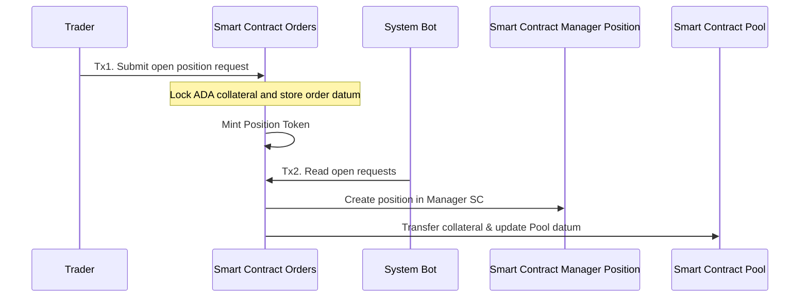
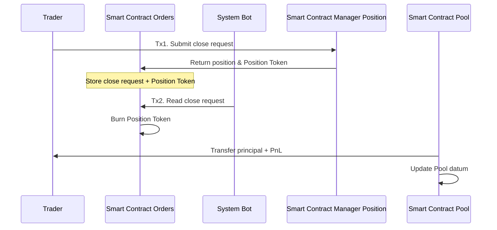
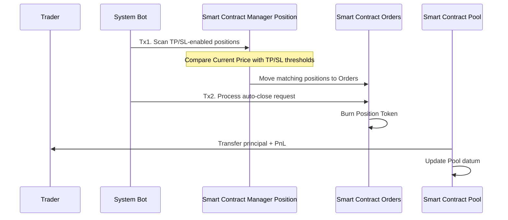
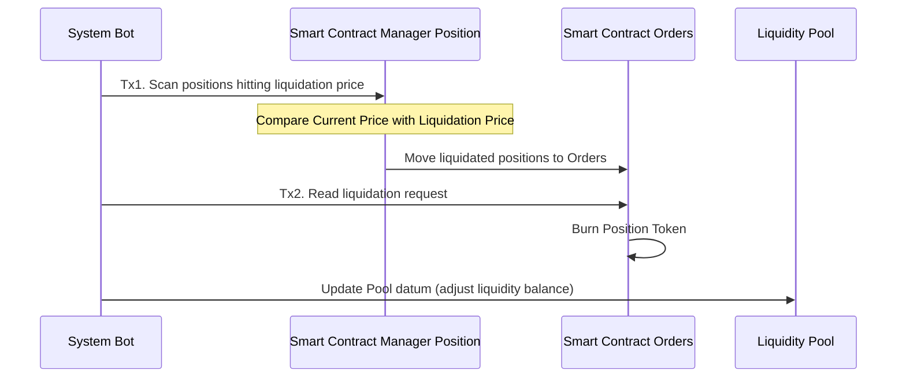
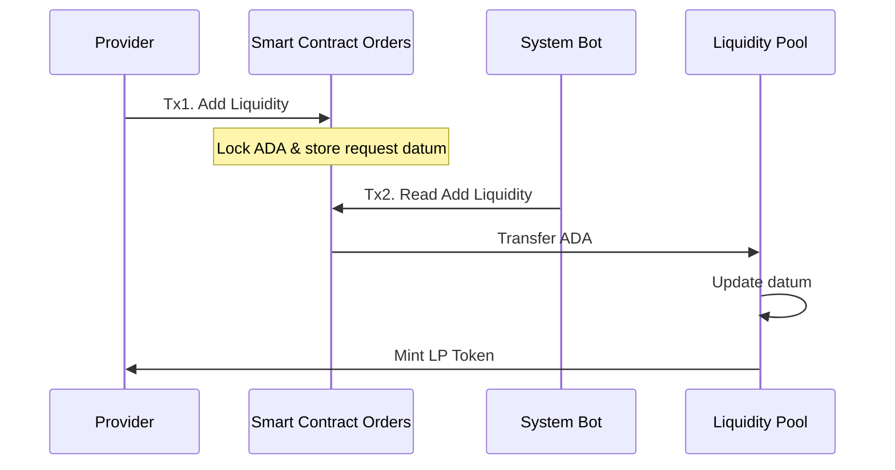
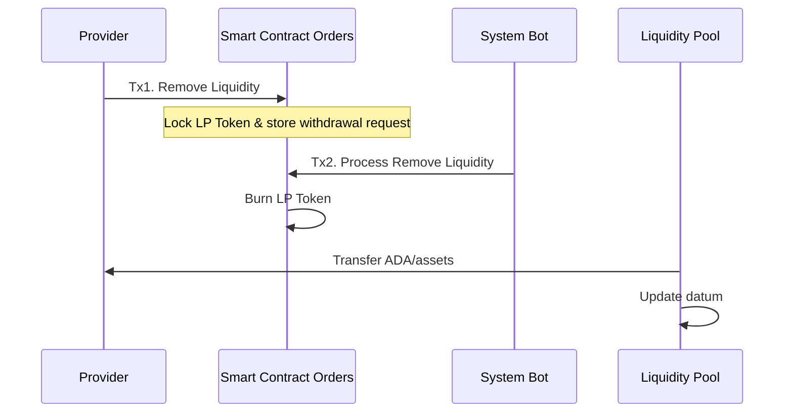

# System Flow Document (SFD)

## 1. Purpose of Document
The **System Flow Document (SFD)** describes the following:

- Complete transaction flows between **Trader – LP – Bot – Smart Contract – Pool**
- Detailed internal processing steps
- Dual-transaction architecture:
  - **Tx1:** User initiates the request
  - **Tx2:** Bot processes and completes the operation
- Smart Contract interactions, including:
  - **SC Orders** – receives requests & locks assets
  - **SC Manager Position** – manages active positions
  - **SC Pool** – manages assets, funding, and liquidity

This document serves as a foundation for developing the **Smart Contract logic**, **Bot Engine**, and **Database layer**.

---

## 2. System Components

| Component | Role |
|----------|------|
| **Trader** | Opens/closes Long or Short positions |
| **LP – Liquidity Provider** | Adds and removes liquidity |
| **Smart Contract Orders** | Receives requests, locks ADA, stores datum, mints tokens |
| **Smart Contract Manager Position** | Stores active position states |
| **Smart Contract Pool** | Manages liquidity, funding rate, and PnL |
| **System Bot** | Automatically processes Tx2 transactions |
| **Oracle Price Feed** | Provides real-time price data for SL/TP and liquidation logic |

---

## 3. Flow 1 – Trader Opens Position (Open Position Flow)

### **Tx1 – Trader creates request**
- Trader submits a transaction to open a position.
- ADA collateral is **locked inside SC Orders**.
- Orders stores a **datum describing the order**.
- Orders **mints a Position Token** representing this pending order.

### **Tx2 – System Bot processes request**
- Bot scans Orders in **FIFO order**.
- Bot performs transfers:
  - ✔ Position Token → Manager Position  
  - ✔ Collateral → Pool  
  - ✔ 2.5 ADA service fee → Manager Position  
- Manager Position creates a **new position**.
- Pool updates **total liquidity**.

### **Sequence Diagram**

---

## 4. Flow 2 – Trader Closes Position (Close Position Flow)

### **Tx1 – Trader creates request**
- Trader submits close-position request.
- Manager transfers **Position Token + position state** back to Orders.
- Orders stores the close request in a new UTxO.

### **Tx2 – Bot processes**
- Bot reads the close request.
- Burns the Position Token.
- Calculates **principal + PnL**.
- Transfers funds from Pool to Trader.
- Pool updates its datum.

### **Sequence Diagram**

---

## 5. Flow 3 – Auto Close (Take Profit / Stop Loss)

### **Tx1 – Bot detects TP/SL condition**
- Bot scans Manager Position.
- Compares current market price with TP/SL thresholds.
- Eligible positions are moved from Manager Position → Orders.

### **Tx2 – Bot processes**
- Burns Position Token.
- Transfers funds from Pool → Trader.
- Pool updates liquidity state.

### **Sequence Diagram**

---

## 6. Flow 4 – Liquidation Flow

### **Tx1 – Bot detects liquidation condition**
- Bot compares current price with liquidation threshold.
- Moves affected position and its token to Orders.

### **Tx2 – Bot processes liquidation**
- Burns Position Token.
- Updates Pool balance reflecting partial or full collateral loss.
- Finalizes the position.

### **Sequence Diagram**

---

## 7. Flow 5 – Provider Adds Liquidity (Add Liquidity)

### **Tx1 – Provider creates request**
- LP sends ADA to SC Orders.
- Orders stores an add-liquidity datum.

### **Tx2 – Bot processes**
- Reads add-liquidity requests.
- Transfers ADA to Pool.
- Pool mints LP Tokens and sends them to Provider.

### **Sequence Diagram**

---

## 8. Flow 6 – Provider Removes Liquidity (Remove Liquidity)

### **Tx1 – Provider submits request**
- LP Token is locked in Orders.
- Orders stores a remove-liquidity datum.

### **Tx2 – Bot processes**
- Burns LP Token.
- Transfers ADA/assets to Provider.
- Pool updates its liquidity data.

### **Sequence Diagram**

---

## 9. Processing Architecture Summary

| Operation Type | Tx1 (User) | Tx2 (Bot) | Token | Pool Updated? |
|----------------|------------|-----------|--------|----------------|
| Open Position | Trader | Bot | Position Token (mint) | Yes |
| Close Position | Trader | Bot | Position Token (burn) | Yes |
| Auto TP/SL | Bot | Bot | Position Token (burn) | Yes |
| Liquidation | Bot | Bot | Position Token (burn) | Yes |
| Add Liquidity | Provider | Bot | LP Token (mint) | Yes |
| Remove Liquidity | Provider | Bot | LP Token (burn) | Yes |

