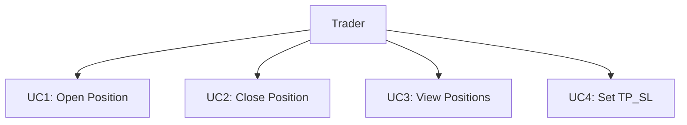
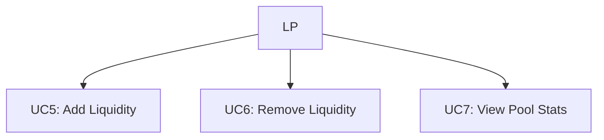
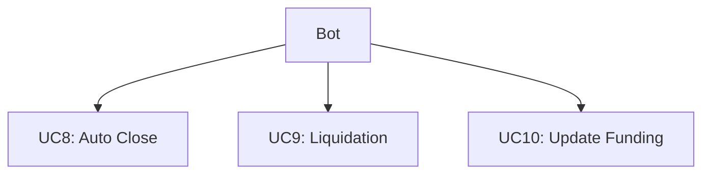
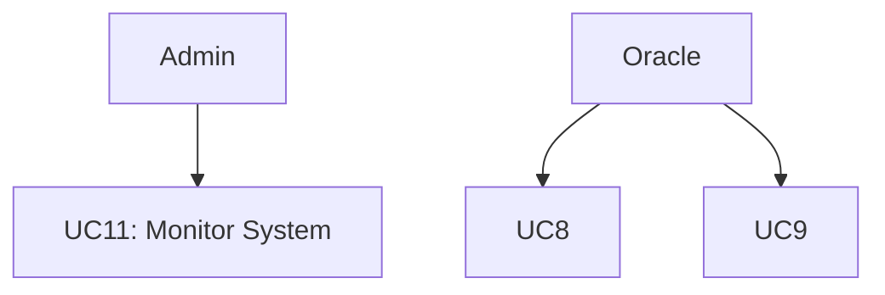
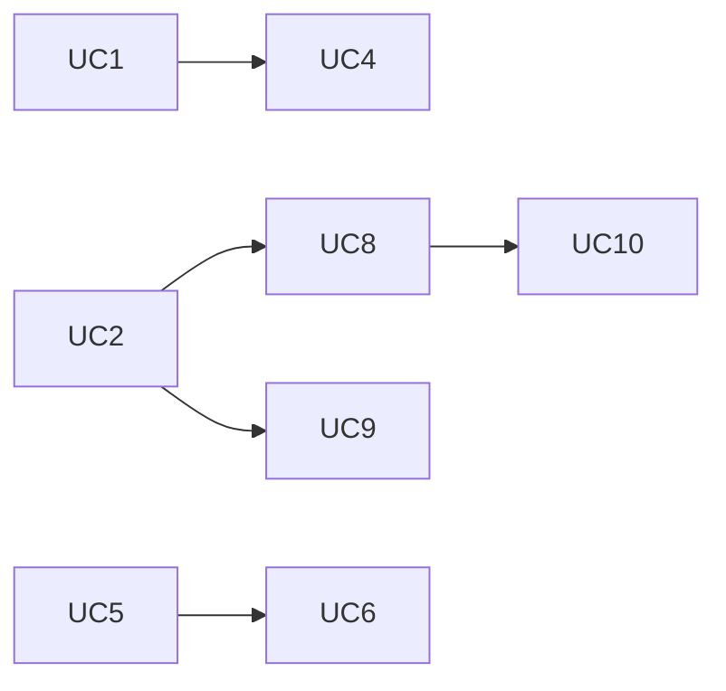
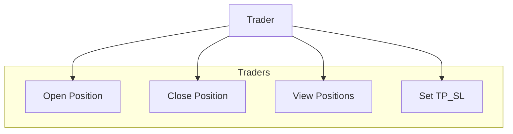
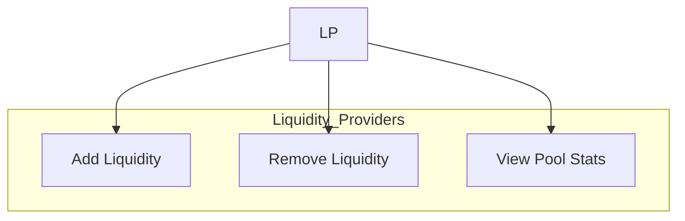
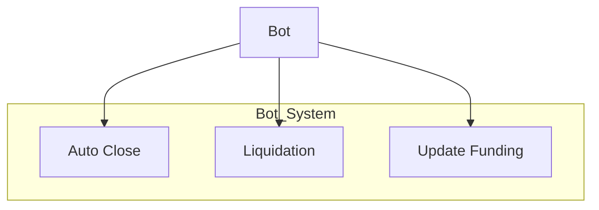
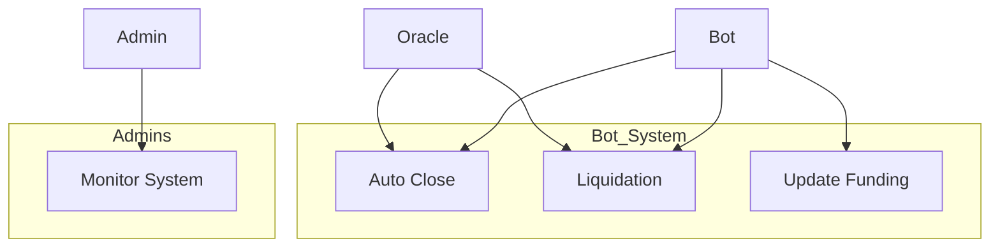

# User Case Document

# **Use Case Diagram & Specification (UC)**

## 1. Document Purpose

This document defines the **Use Cases** provided by the Hydra Perp DEX system, who the users (actors) are, and how they interact with the system.  
It serves as the foundation for developing the **System Design**, **UI/UX**, and **Test Plan**.

---

## 2. Actors

| Actor | Role | Permissions |
|-------|------|-------------|
| Trader | User performing trading operations | Create and manage personal positions |
| Liquidity Provider (LP) | Investor providing liquidity | Add / Remove liquidity |
| Bot System | Automated actor | Processes TP/SL, Funding, Liquidation |
| Smart Contracts | On-chain contracts (Orders, Manager, Pool) | Execute trading logic |
| Oracle Feed | Price source | Provide price data for Bot |
| Admin | System administrator | Monitor pool and technical parameters |

---

## 3. Overall Use Case Diagram

---

## 4. Detailed Use Case List

| ID | Use Case Name | Main Actor | Goal | Short Description | Success Outcome | Failure Outcome |
|----|---------------|------------|------|-------------------|------------------|------------------|
| **UC1** | Open Position | Trader | Open Long/Short position | Trader sends Tx1 creating UTxO at SC Orders; Bot processes Tx2 to open position | Position stored in SC Manager | Insufficient liquidity / datum error |
| **UC2** | Close Position | Trader | Close an existing position | Trader sends Tx1; Bot processes Tx2 and returns funds | Position closed & Pool updated | Price error or pending Bot processing |
| **UC3** | View Positions | Trader | View open positions | UI reads SC Manager / Pool datum | Accurate information displayed | Data not found |
| **UC4** | Set TP_SL | Trader | Update TP/SL | Trader sends Tx updating position datum | TP/SL saved and monitored by Bot | Invalid values or datum error |
| **UC5** | Add Liquidity | LP | Add assets to pool | LP sends Tx1 to Orders; Bot processes Tx2 and mints LQ tokens | LP receives liquidity tokens | Invalid format or no available slot |
| **UC6** | Remove Liquidity | LP | Withdraw assets from pool | LP sends Tx1 with LQ tokens; Bot burns LQ and returns assets | LP receives assets + yield | Insufficient liquidity / SC error |
| **UC7** | View Pool Stats | LP | View pool information | UI reads SC Pool datum | Shows volume, APR | Pool unsynchronized |
| **UC8** | Auto Close | Bot System | Auto close TP/SL | Bot reads Oracle price, triggers Tx2 to close position | TP/SL executed successfully | Price mismatch or Bot failure |
| **UC9** | Liquidation | Bot System | Liquidate position | Bot detects below-margin positions, burns token, updates Pool | Pool remains solvent | Calculation or funding error |
| **UC10** | Update Fee | Bot System | Update funding fee | Bot updates fee | Correct fee updated | Wrong write or timeout |
| **UC11** | Monitor System | Admin | Monitor Pool and Bot | Admin accesses monitoring dashboard | Accurate reports & logs | API error or unsynchronized state |

---

## 5. Use Case Relationships (Include / Extend)

> *UC8 (Auto Close) and UC9 (Liquidation) are extensions of UC2 (Close Position).  
UC10 (Funding update) supports Bot operations.*

---

## 6. Actor ↔ Use Case Mapping

---

## 7. Conclusion

- The Use Case set defines **11 primary functionalities** of the Hydra Perp DEX.
- The system clearly separates roles of **Trader / LP / Bot / Admin / Oracle**.
- Use Cases are modular, making them easy to map into **Smart Contracts** and **API endpoints** in the SDD.
- This serves as a foundation for **User Flow, UI wireframes, test scenarios, and milestone planning**.

